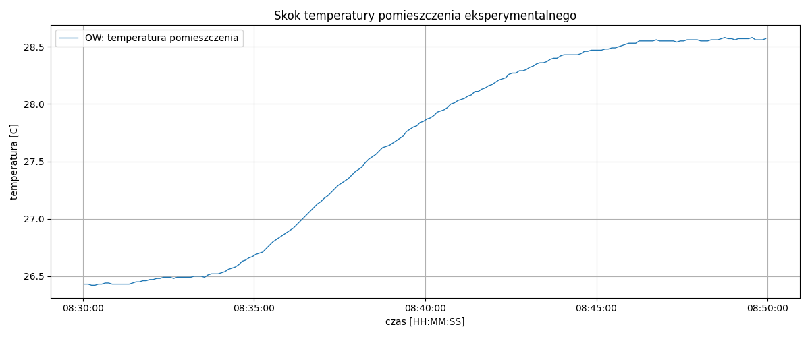
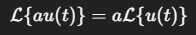
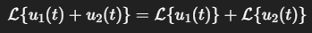
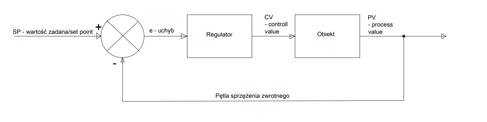

# 1. Obiekt dynamiczy

**Obiektem dynamicznym** nazywa się układ fizyczny, techniczny lub abstrakcyjny, którego stan oraz wyjście w danej chwili czasu zależą nie tylko od aktualnych wartości sygnałów wejściowych, lecz również od ich historii, a także od stanu początkowego układu.

Innymi słowy, obiekt dynamiczny posiada *pamięć* – jego zachowanie jest determinowane przez całą przeszłość sygnałów wejściowych, a nie tylko przez ich wartość bieżącą.

**Przykład:**

Obiekt statyczny
- rezystor
  - wejście - napięcie podane
  - wyjście - prąd zmierzony na nim
    
*nie musimy czekać jego odpowiedź następuje natychmiastowo a jego poprzedni stan czy stan początkowy jest nie istotny (mówiąc o idealnym rezystorze)*

Obiekt dynamiczny 
- obiekt cieplny (np. pomieszczenie)
  - wejście - moc na grzejniku
  - wyjście - temperatura pomieszczenia
*chwile czasu zajmuje by temperatura grzejnika i pomieszczenia się ustabilizowała*

*Poniżej przykładowa (real szit badanie) odpowiedź skokowa obiektu dynamicznego cieplnego*

Opisy obiektów dynamicznych:
- równania różniczkowe
  - gdy wyprowadzamy model z praw fizyki
  - dobra interpretacja wielkości fizycznych
- Transmitancja
  - dla układów liniowych i stacjonarnych
  - prosta analiza dynamiki, stabilności a nawet odpowiedzi częstotliwościowych
- Zmienne stanu
  - dobry dla wielowymiarowych układów
  - naturalny dla układów nieliniowych

## 1.1 Klasyfikacja obiektów dynamicznych

- Liniowe - Nieliniowe
  - ze względu na spełnienie zasady superpozycji
- Stacjonarne - Niestacjonarne
  - ze względu an to czy parametry obiektu się zmieniają w czasie
- Deterministyczne - Niederministyczne
  - ze względu na to czy obiekt posiada elementy losowości (np. szum)
- Ciągłe - Dyskretne
  - ze względu na dziedzinę czasu
- Jednowymiarowe - Wielowymiarowe
  - ze względu na liczbę sygnałów (SISO - single input single output, MIMO - multiple input multiple output, SIMO, MISO)

### Zasada superpozycji *na szybko*

Obiekt (uklad) jest **liniowy**, jezeli spelnia **zasade superpozycji**, ktora sklada sie z dwoch wlasnosci:
1. **skalowalnosc (jednorodnosc)**
   
   
3. **sumowanie sygnalow (addytywnosc)**
   
   

**funkcje nieliniowe**
-naturalnie obiekt nie może składać się z funkcji nieliniowych np. trygonometrycznych czy wykładniczych

## 1.2 Sterowanie adaptacyjne

**Sterowanie adaptacyjne** to metoda sterowania, w której regulator dopasowuje parametry (które
ulegają zmianie lub na początku są niepewne). Przykładowo podczas lotu masa samolotu, na skutek
zużycia paliwa, powoli zmniejsza się - potrzebna jest wiec zasada sterowania, która sama się dostosuje do takich zmiennych warunków.

**Przykład:**
Parametry PID zmieniają się w czasie bo obiekt jest jakiś dziwny (przez to że np. jest nieliniowy lub obiekt jest niestacjonarny) i to poprawia jego sterowanie

## 1.3 Sterowanie wielopoziomowe

**Sterowanie wielopoziomowe** to koncepcja zarządzania złożonymi systemami polegająca na
podziale zadania sterowania na warstwy o różnym stopniu decyzyjności i różnych horyzontach czasowych.

Z tym pojęciem często wiąże się pojęcie dekompozycji czyli rozdzielenia obiektu na pomniejsze (np. nieliniowego na pomniejsze liniowe lub takie które poprostu łatwiej nam ogarnąć)

**Przykład:**

Manipulator

1. Decyzja o trajektorii
2. Regulacja ruchu (położenia)
3. Sterowanie niskopoziomowe (regulacja PWM, przyśpieszenie itp.)

## 1.4 Dodatek dla przypomnienia bo ostrzegała nas prowadząca seminaria

**Układ sprzężenia zwrotnego**

*poniżej przykład schematu blokowego układu z zamkniętym ujemnym sprzężeniem zwrotnym (w tym przypadku w miejscu regulatora można dać PID)*

