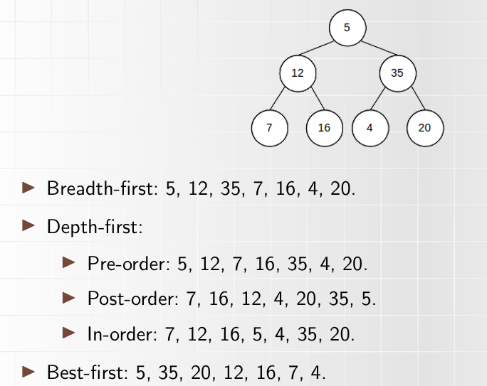
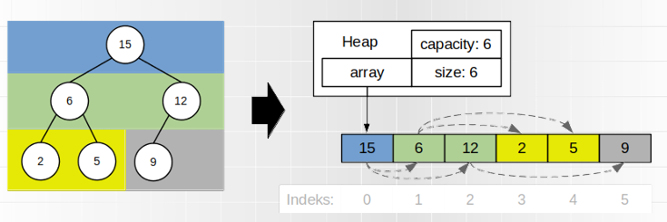
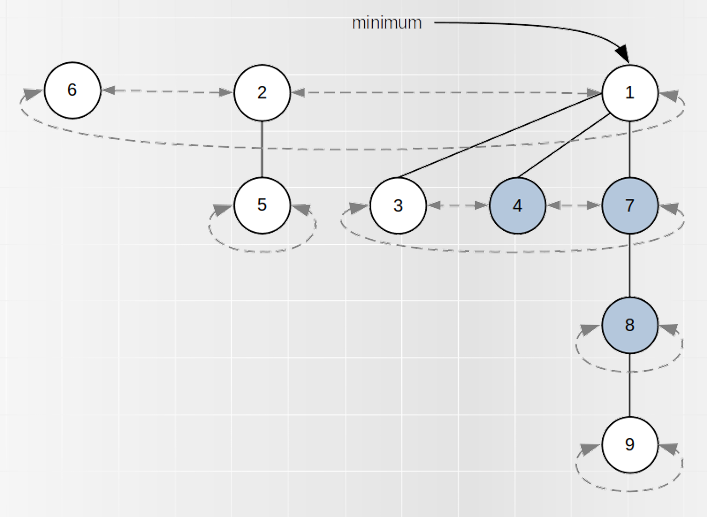
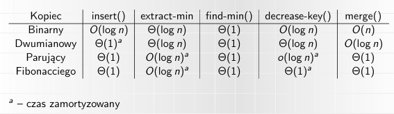
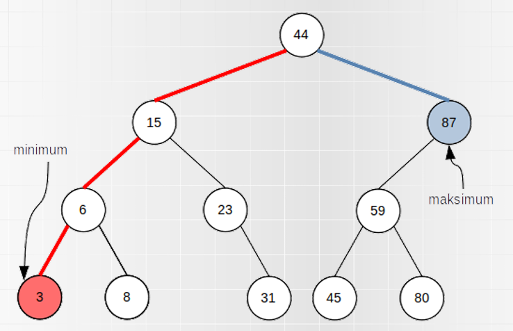
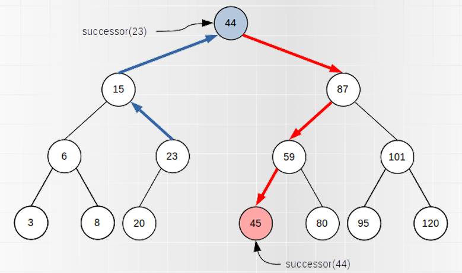
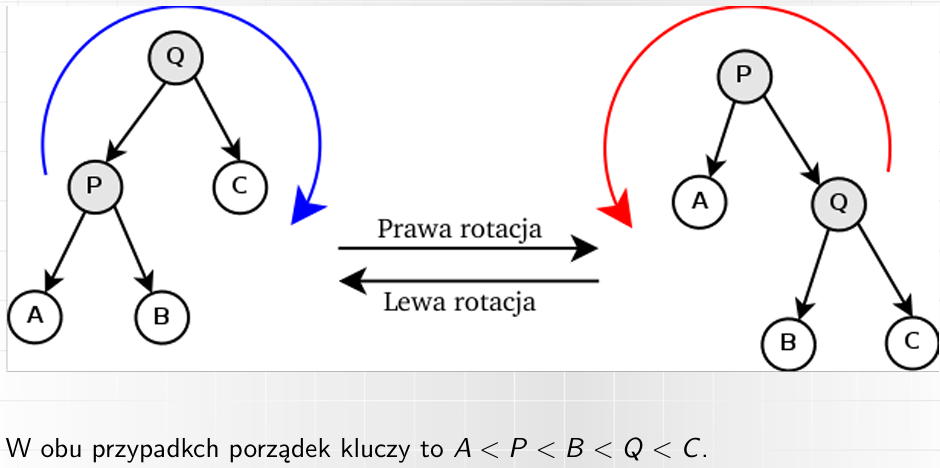

Disclaimer: obeznanie z zagadnieniami z punktów 0, 1 i 2 jest konieczne do przyswojenia następnych. Faktyczne zagadnienie do egzaminu aczkolwiek nie obejmuje stricte prostych struktur danych opisanych w punktach 1 i 2.

## 0. Wstęp

### ADT a struktura danych

**ADT** (Abstract Data Type) (np. lista) oznacza definicję typu danych tylko za pomocą wartości i operacji na tym typie danych.
**Struktura danych** (np. tablica dynamiczna, lista wiązana) jest konkretną implementacją ADT.

### Złożoność obliczeniowa

Najpopularniejszą notacją jest notacja dużego O - oznacza ona, że złożoność operacji jest **co najwyżej rzędu g** dla O(g). Jeśli nie zostało podane sprecyzowanie, to standardowo mowa jest zawsze o złożoności pesymistycznej.

Często wykorzystywanymi rzędami, przedstawionymi w kolejności rosnącej, są:

- O(1) - złożoność stała
- O(log n) - złożoność logarytmiczna
- O(n) - złożoność liniowa
- O(n^2) - złożoność kwadratowa
- O(n^3) - sześcian
- O(2^n) - złożoność wykładnicza
- O(n!) - silnia

Wszystkie notacje zostały przedstawione na [rysunku](image-7.png).

## 1. Listy jedno i dwukierunkowe, listy samoorganizujące się

**Lista (ADT)** jest kontenerem przechowującym elementy, mogące być różnych typów. Określa ona kolejność elementów, mogą się one powtarzać. Jeden element ma jedną wartość (ale tą wartością może być kolejna lista).

Lista ma zmienną dlugość i zawartość - elementy można dodawać, usuwać i modyfikować. Typowo rozważane operacje na listach to:

- stworzenie pustej listy
- dostęp (zwrócenie) elementu na pozycji _i_
- dodanie elementu _e_ na pozycji _i_, w tym:
- - dodanie elementu _e_ na początek listy
- - dodanie elementu _e_ na koniec listy
- usunięcie elementu _e_ na _i_ pozycji, w tym:
- - usunięcie elementu _e_ na początku listy
- - usunięcie elementu _e_ na końcu listy
- zwrócenie rozmiaru (liczby elementów) listy
- sprawdzenie czy lista jest pusta
- wyszukanie elementu _e_

### Implementacje ADT listy:

#### Tablica dynamiczna

Tablica dynamiczna najczęściej przechowuje:

- **array** - wskaźnik na tablicę utworzoną dynamicznie
- **capacity** - rozmiar tablicy array (w liczbie elementów)
- **size** - liczba przechowywanych elementów

W związku z tym zajmowana pamięć to capacity + 3, czyli O(capacity). W praktyce jako, że capacity < 2n, to pamięć jest rzędu O(n).

Cechą charakterystyczną dla tablicy _dynamicznej_ jest wykorzystanie funkcji _realloc()_ w celu zmianu rozmiaru tablicy - dzieje się to w momencie dodania elementu, jeśli nie ma na niego miejsca (size jest równy capacity). Istnieją dwa głowne podejścia:

- zwiększanie capacity o 1 (capacity = capacity + 1)
- zwiększanie capacity razy 2 (capacity = capacity \* 2)

W drugiej z opcji osiągane są lepsze wyniki pod względem złożoności obliczeniowej, w zamian za gorsze pod względem złożoności pamięciowej.

Tablica przy wykonaniu operacji _realloc()_, może wymagać przeniesienia do nowej lokalizacji (_memcpy()_).

Na [rysunku](image-1.png) widoczne jest porównanie przypadku pesymistycznego vs koszt amortyzowany dla operacji dodawania elementu do tablicy dynamicznej, przy wykorzystaniu zwiększania capacity razy dwa. Koszt amortyzowany uśrednia pesymistyczne przypadki dla kolejnych elementów (w uproszczeniu).

Na [rysnku](image-3.png) znajduje się złożoność operacji dla tablicy dynamicznej. **Ważne**: przedstawione złożoności odnoszą się do wersji z wprowadzonym usprawnieniem w postaci zaalokowania miejsca na "indeksy ujemne" (umożliwienie dodawania elementów na początku tablicy bez potrzeby przesuwania wszystkich elementów o jedno miejsce dalej).

Dodatkowo, **wszystkie z pozostałych wymienionych w ADT listy operacje oprócz wyszukania elementu _e_ odbywają się w czasie stałym (O(1))**. Wyszukanie elementu _e_ po jego wartości zamiast indeksie wymaga w pesymistycznych przypadku przeszukania całej tablicy (O(n)).

#### Lista wiązana (jednokierunkowa)

W liście wiązanej każdy element (węzeł) zawiera:

- właściwą wartość (value)
- wskaźnik na kolejny element listy (next)

Elementy mogą mieć różną lokalizację w pamięci (w przeciwnieństwie do tablicy dynamicznej).

Struktura przechowuje wskaźnik _head_ na pierwszy element. Lista kończy się gdy wskaźnik ma wartość _null_. Oprócz tego przechowywany jest _size_.

Zajmowana pamięć wynosi 2n + 2, czyli O(n).

Możliwym usprawnieniem jest dodanie wskaźnika _tail_, który wskazuje na ostatni element listy (dla listy pustej null). Umożliwia on dodawanie elementu na koniec listy w czasie O(1) zamiast O(n).

Na [rysunku](image-5.png) znajdują się złożoności operacji dodawania dla listy wiązanej.

- stworzenie pustej listy
- dostęp (zwrócenie) elementu na pozycji _i_
- dodanie elementu _e_ na pozycji _i_, w tym:
- - dodanie elementu _e_ na początek listy
- - dodanie elementu _e_ na koniec listy
- usunięcie elementu _e_ na _i_ pozycji, w tym:
- - usunięcie elementu _e_ na początku listy
- - usunięcie elementu _e_ na końcu listy
- zwrócenie rozmiaru (liczby elementów) listy
- sprawdzenie czy lista jest pusta
- wyszukanie elementu _e_

Dodatkowo, stworzenie pustej listy, zwrócenie rozmiaru listy oraz sprawdzenie czy lista jest pusta odbywa się w czasie stałym (O(1)). Dostęp (zwróćenie elementu) zarówno po pozycji oraz po wartości odbywa się w złożoności O(n). Usuwanie elementów odbywa się analogicznie do ich dodawania.

#### Lista dwukierunkowa

Lista dwukierunkowa jest listą wiązaną, w której każdy element (węzeł) ma wskaźnik zarówno do następnego elementu (next), jak i do poprzedniego (prev). Struktura ta przechowuje wskaźniki _head_ i _tail_.

Zajętość pamięci wynosi 3n + 3 - jest to wciąż O(n) nastomiast jest to znacząco więcej niż lista wiązana jednokierunkowa.

Dzięki dodaniu wskaźników prev przemieszczanie się po liście jest ułatwione, a czas dotarcia do węzła _i_ jest dwukrotnie krótszy, natomiast nadal jest to O(i). Różnica ta jest znacząca dla operacji dodawania/usuwania na dowolnej pozycji, szukania oraz przeglądania.

#### Lista cykliczna

W przypadki listy cyklicznej ostatni element wskazuje na pierwszy (zamiast na null). Dla listy dwukierunkowej też pierwszy element wskazuje na ostatni. Wciąż istnieje wskaźnik _head_, ponieważ jest on konieczny do umożliwienia dostania się do listy, natomiast dowolny element jest początkiem/końcem listy.

Lista cykliczna jest wykorzystywana do implentacji niektórych kolejek, buforów cyklicznych oraz kopca Fibonacciego. Jest ona przydatna gdy po liście przechodzimy wielokrotnie.

#### Lista z przeskokiem

Jest to probabilistyczna struktura danych. Lista z przeskokiem stanowi rozszerzenie listy wiązanej o wielokrotne wiązania - wiązania mogą pomijać elementy, co widoczne jest na [rysunku](image-6.png).

#### Samoorganizujące się listy

Istnieje kilka implementacji ADT listy w postaci samoorganizujących się list. Są to takie struktury, gdzie elementy zmieniają kolejność w wyniku kolejnych operacji dostępu/wyszukiwania. Jeśli są one częściej używane, to stają się łatwiej dostępne. Te rozwiązania najlepiej sprawdzają się, gdy 20% elementów jest celem 80% wyszukiwań (Zasada 80-20).

Wśród nich znajdują się:

- **Metoda move-to-front**
- **Metoda transpose (swap)**
- **Metoda count**

## 2. Stosy, kolejki, kolejki cykliczne, kolejki priorytetowe

Kolejka - ADT, w którym dodawanie i usuwanie elementów jest ze sobą powiązane tj. usuwany element, jest określony przez cechy elementów dodanych do tej pory (np. przez ich kolejność, priorytet).

Typowe operacje na kolejkach:

- dodanie elementu
- usunięcie elementu
- sprawdzenie czy kolejka jest pusta (bądź zwrócenie rozmiaru)
- podgląd do usunięcia (peek), ale bez usuwania

Kolejki zasadniczo nie służą do dostępu do dowolnego elementu, wyszukiwania czy przeglądania - aby dostać się do trzeciego elementui, należy najpierw zdjąc element pierwszy i drugi.

### Implementacje ADT kolejki:

#### Kolejka FIFO - Sterta

Kolejka FIFO, zwana także stertą (heap) to standardowy rodzaj kolejki (jeśli nie zostanie podane doprecyzowanie rodzaju). Zasada FIFO (First In First Out) oznacza, że element dodany jako pierwszy jest usuwany jako pierwszy (analogicznie do kolejce do kasy w sklepie).

Operacja dodawania nazywa się **enqueue**, a zdejmowania **dequeue**.

Złożoność obliczeniowa zależy od tego jaką implementacje listy wybierzemy. Dla listy wiązanej jednokierunkowej z tail oraz dla listy dwukierunkowej wszystkie operacje posiadają złożoność O(1) (aczkolwiek odznaczają się większą zajętością miejsca w pamięci). Dla tablicy dynamicznej wszystkie operacje także mają założoność O(1), jeśli pod uwage zostanie wzięty czas amortyzowany.

Dla listy wiązanej jednokierunkowej (bez tail) złożoność jest zależna od tego w jakiej kolejności ustawimy elementu (z której strony następuje enqueue i dequeue) - w obu przypadkach minimum jedna operacja jest w czasie liniowym zamiast stałym.

Kolejka FIFO jest wykorzystywana do m.in. buforów, przechowywania żądań obsługiwanych w kolejności żadąń, modelowania kolejek sklepowych czy przeglądzie wszerz drzewa.

#### Kolejka LIFO - Stos

Kolejka LIFO, zwana także stosem (stack) wykorzystuje zasade LIFO czyli Last In First Out - oznacza to, że element dodany jako ostatni jest usuwany jako pierwszy (analogicznie do stosu talerzy w szufladzie).

Dla kolejki LIFO operacja dodawania nazywa się **push()**, zdejmowania **pop()**, a peek często nazywana jest **top()**.

Złożoność dla każdej ze struktur: tablica dynamiczna, lista wiązana jednokierunkowa (zarówno z samym head oraz head i tail) i tablica dwukierunkowa, wynosi O(1) dla wszystkich operacji (jeśli weźmiemy pod uwagę koszt amortyzowany dla tablicy dynamicznej oraz ustawimy elementy w liście wiązanej jednokierunkowej z samym head, tak że ostatnio dodany element znajduje się na początku).

Kolejka LIFO jest wykorzystywana do m.in. przeglądu w głąb drzewa i algorytmów z nawrotami (backtracking).

#### Kolejka dwukierunkowa

Kolejka dwukierunkowa charakteryzuje się tym, że możliwe jest zarówno dodawanie, jak i usuwanie elementów na obu końcach. Zwana jest ona także deque (double-ended que).

Kolejka LIFO i FIFO mogą być traktowane jako uszczegółowienie (wzięcie pod uwage zaledwie części operacji operacji) deque, a deque może być brane pod uwage jako uszczegółowienie listy, co widoczne jest na [rysunku](image-8.png).

Wszystkie operacje będą miały złożoność stałą dla implementacji z użyciem listy wiązanej jednokierunkowej z tail oraz listy dwukierunkowej, a także tablicy dynamicznej, jeśli weźmiemy pod uwagę koszt amortyzowany. Dla listy wiązanej jednokierunkowej z samym head żłożoność dla części operacji jest liniowa.

#### Kolejka cykliczna

Kolejka (bufor) cykliczny ma zwykle stały rozmiar i działa w charakterze FIFO. Posiada ona dwa wskaźniki - na aktualny początek (odczyt) i koniec (zapis) kolejki, co widoczne jest na [rysunku](image-9.png).

Gdy jeden wskaźnik dogoni drugi, operacja możliwa jest dopiero po przesunięciu drugiego wskaźnika. Stare dane są nadpisywane przez nowe.

Przy dobrej implementacji czas operacji wynosi O(1).

#### Kolejka priorytetowa

Kolejka priorytetowa to taka kolejka, w której każdy element ma przypisany priorytet liczbowy - wszystkie elementy są parą klucz-wartość (gdzie na kluczach da się określić minimum/maksimum).

O kolejności kolejki decyduje priorytet elementów - zdejmowanie elementu zawsze zdejmuje element o największym (bądź najmniejszym) priorytecie.

Może istnieć wiele elementów o tym samym priorytecie. Dla strategii FIFO (stabilnej) mamy gwarancję zdejmowania elementów w kolejności ich dodawania, natomiast można stosować także niestabilną strategię.

Dla kolejki priorytetowej typu max istnieją następujące opracje:

- insert(e,p) - dodanie elementu _e_ o priorytecie _p_
- extract-max() - usunięcie i zwrócenie elementu o największym priorytecie
- find-max() - zwrócenie elementu o największym priorytecie
- modify-key(e,p) - zmiana priorytetu elementu _e_ na _p_ (można podzielić na operacje decrease-key i increase-key)

Jej zaimplementowanie jest możliwe na dwa sposoby

- łatwiejsze dodawanie - elementy dodajemy po kolei (w czasie stałym), dla usuwania oraz podejrzenia należy przeszukać (w pesymistycznym przypadku) całą listę
- łatwiejsze usuwanie - elementy dodajemy w kolejności według priorytetu (w czasie liniowym), natomiast usuwanie oraz podejrzenie odbywać się będzie w czasie stałym

Operacja modyfi-key(e,p) w obu podejściach odbywać się będzie w czasie liniowym.

## 3. Drzewa binarne, kopce

**Drzewo** jest zbiorem wierzchołków (węzłów) oraz łączących je krawędzi. Można je podzielić na poziomy, gdzie na zerowym poziomie jest tylko jeden wierzchołek (korzeń drzewa) i ma on połączenia jedynie z wierzchołkami na poziomie pierwszym.

Kolejne wierzchołki mają zawsze dokładnie jedno połączenie z jednym z wierzchołków na poziomie poprzednim (jest to jego rodzic) oraz dowolną (0 lub więcej) liczbę połączeń z wierzchołkami na poziomie kolejnym (są to jego dzieci/synowie/potomkowie). Wierzchołki bez dzieci nazywami liścmi.

Drzewo można zdefiniować też jako graf, który jest nieskierowany, spójny i acykliczny.

Czy drzewo jest ADT czy strukturą danych? To zależy. Powszechnie jest uważane za strukturę danych, mimo że definicja drzewa nieokreśla sposobu rozmieszczenia danych w pamięci ani złożoności operacji. Aczkolwiek z matematycznego i informatycznego punktu widzenia można na drzewo patrzeć jako na ADT.

#### Typowe operacje na drzewach:

- dodanie elementu
- usunięcie elementu
- wyszukanie elementu
- usunięcie poddrzewa
- rotacja poddrzewa
- przeglądnięcie drzewa (odwiedzenie wszystkich wierzchołków w pewnej kolejności)

#### Zastosowanie drzew:

- modelowanie hierarchii
- procesy decyzyjne
- rokład gramatyczny zdań

#### Rodzaje drzew

- binarne - każdy węzeł ma conajwyżej dwóch potomków
- binarne zupełne - każdy węzeł, który nie jest liściem ma dokładnie dwóch potomków, a liście mają conajwyżej dwóch potomków, impikuje binarne
- binarne pełne - każdy węzeł ma dokładnie dwóch potomków, implikuje binarne i binarne zupełne

Wysokość drzewa binarnego zupełnego (pesymistyczna) wynosi zaledwie O(log n), gdzie n to liczba węzłów. Wysokość drzewa binarnego (pesymistyczna) wynosi aż O(n).

#### Rodzaje przejść przez drzewo

- breadth-first (wszerz) - rodzeństwo węzła jest odwiedzane przed jego dziećmi (odpowiada kolejce FIFO)
- depth-first (wgłąb) - dzieci węzła są odwiedzane przed jego rodzeństwem (odpowiada kolejce LIFO)
  - pre-order - rodzic odwiedzany przed swoimi dziećmi
  - post-order - rodzic odwiedzany po swoich dzieciach
  - in-order - najpierw odwiedzany lewy syn, potem rodzic, potem prawy syn (dotyczy drzew binarnych)
- best-first (najpierw najlepszy) - odwiedzany wg preiorytetu (odpowiada kolejce priorytetowej)

Kopiec (heap) - drzewo, w którym zachowana jest zasada kopca tzn. klucz rodzica jest w stałej relacji z kluczami jego dzieci, z rozróżnieniem na: - max heap (rodzic niemniejszy od swoich dzieci) - min heap (rodzic niewiększy od swoich dzieci)
Dzięki temu każda ścieżka od korzenia do liścia jest posortowana (a cały kopiec jest posortowany częściowo). Jeśli węzły nie mają klucza, to kluczem staje się wartość.

Kopce również mogą być binarne, binarne zupełne i binarne pełne.

Kopiec binarny zupełny można zaiplementować za pomocą tablicy dynamicznej. Dzieci każdego rodzica o indeksie k mają indeksy 2k+1 oraz 2k+2 - tym samym można wydedukować, że indeks rodzica każdego dziecka o indeksie l to floor((l-1)/2). Jest to wydajna i prosta implementacja, a dzięki temu, że kopiec jest zupełny, to nie ma w tablicy dziur, a znając indeks dostęp do węzła jest w czasie O(1).

#### Operacje kopcowe (dla kopca typu max):

- insert()
- extract-max() - usunięcie i zwrócenie elementu o największym kluczu
- find-max() - zwrócenie elementu o największym kluczu
- find() - szukowanie po kluczu/wartości elementu
- delete() - usunięcie po wartości elementu
- decrease-key()/increase-key()
- build() - zbudowanie kopca z n elementów

Przy dodawaniu i usuwaniu elementów bez wykonania dodatkowych czynności zostałaby utracone własności kopca. Do tego służą operacje pomocnicze

- heapify-up (przy dodawaniu elementu oraz increase-key) - zaczynając od elementu e, sprawdzamy czy element e jest w prawdłowej relacji ze swoim rodzicem (lub jest korzeniem i nie ma rodzica), jeśli nie jest to je zamieniamy; powtarzamy sprawdzenie i zamiane, aż nie będzie potrzeby zamiany
- heapify-down (przy extract-max oraz decrease-key) - zaczynając od elementu e, sprawdzamy czy element jest w prawidłowej relacji ze swoim dziećmi (lub jest liściem i nie ma dzieci), jeśli nie jest to zamieniami go z większym z dzieci; powtarzamy sprawdzenie i zamiane, aż nie będzie potrzeby zamiany

Dla usuwania elementu po jego wartości używane jest heapify-up lub heapify-down w zależności od potrzeby (lub też żadne z nich). Pesymistyczny czas operacji heapify-up i heapify-down odpowiada wysokości drzewa w związku z czym wynosi O(log n).

Dla insert ważnym jest, że przed wykonaniem heapify-up wstawiamy nowy elementu na pierwsze wolne miejsce (czyli staje się liściem). Dla extract znowuż operacja rozpoczyna się od wstawienia ostatniego elementu w miejsce korzenia (przy zapamiętaniu starego korzenia, aby go zwrócić).

Budowanie kopca (dla kopca binarnego zupełnego) odnosi się do wypełnienia pustej struktury (dodaniu po kolei wielu elementów). Da się to wykonań szybciej niż naiwne podejścia wykonania operacji insert n razy, co dałoby złożoność O(n log n). Należy dodać wszystkie elementy bez zachowywania własności kopca, a następnie wykonać heapify-down dla indeksów z (w przybliżeniu) pierwszej połowy (czyli dla węzłów niebędących liścmi), co skróci czas do O(n).

#### Zastosowanie kopców

- sortowanie przez kopcowanie
- algorytmy selekcji
- kolejki priorytetowe
- algorytmy grafowe (Dijikstry, Prima)

Kopiec Fibbonacciego - realizacja kolejki priorytetowej w formie lasu (wielu drzew) złożonego z kopców, która oferuje lepszą wydajność niż realizacja poprzez kopiec binarny. Dalej opisywane kopce będą typu min.

Stopień (liczba dzieci) każdego węzła w kopcu Fibbonacciego wynosi co najwyżej log n, a dla węzła o stopniu k rozmiar podrzewa (zakorzenionego w nim) wynosi co njamniej F\_(k+2) (k+2 liczba Fibbonacciego). Dla nie-korzenia x możemy odciąć tylko jednego - gdy odcinamy kolejnego, x samo jest odcinane i staje się osobnym drzewem. Drzewa można łączyć podczas innej operacji. Znaczone (marked) węzły to takie, gdzie co najmniej jeden syn został odcięty od czasu gdy rozpatrywany węzeł został czyimś synem. Potencjał kopca jest zależny od liczby zaznaczonych węzłów.

Wszystkie korzenie są ze sobą połączone listą cykliczną dwukierunkową, tak samo każde grupa rodzeństwa.

Do analizy złożoności kopca Fibbonacciego (widocznej na [rysunku](image-12.png)) stosowana jest metoda potencjału (koszt amortyzowany). Kopiec Fibbonacciego poprawia teoretyczną złożoność niektórych algorytmów grafowych (np. Dijikstra i Prima).

Struktura zbiorów rozłącznych (dis-joint data structure) - struktura przechowująca elementy pogrupowane w zbiory tak, że każdy element należy dokładnie do jednego z bioru (rozbicie zbiorów). Każdy zbiór ma reprezentanta.

Struktura zbiorów rozłącznych jest stosowana m.in. w algorytmie Kruskala.

W praktyce używa się implementacji lasu zbiorów rozłącznych (disjoint-set forest) gdzie każdy zbiór reprezentowany jest przez osobne drzewo, a korzeń drzewa jest reprezentantem zbioru. Pojawia się taka operacja jak union(x,y).

Czas zamortyzowany jest bardzo dobry. Implementacja jest zarówno szybka praktycznie jak i optymalna asymptotycznie (gorsza najwyżej o stałą od najlepszej możliwej).

## 4. Słowniki, binarne drzewa poszukiwań, tablice mieszające

Słownik (mapa, tablica asocjacyjna) - ADT przechowujące elementy w postaci pary klucz-wartość, gdzie klucze mogą być dowolnego typu. Słownik mapuje zbiór kluczy na zbiór wartości - jak funkcja matematyczna, w związku z czym część kluczy może nie mieć wartości (funkcja częściowa).

Czy każdy klucz ma jedną wartość? To zależy. Generalnie tak. Istnieje coś takiego jak multimapa, w której może być kilka wartości do jednego klucza.

Operacje na słowniku:

- insert(k,v) - jeśli element o kluczu k już istnieje to jego wartość zostaje nadpisana przez v
- find(k)/lookup(k)
- delete(k)/remove(k)
- exists(k)
- size()
- empty()
- keys()
- values()

Z definicji ADT słownika nie wynika, że klucze muszą być przechowywane w uporządkowany sposób, aczkolwiek niektóre implementacje tego wymagają. Uporządkowany słownik może być zarówno poprzez posortowanie kluczy (niezależnie od kolejności wstawiania) albo poprzez kolejność wstawiania (niezależnie od kluczy).

Słowniki zakładają szybkie wyszukiwanie elementu po zadanym kluczu. Dla wszelkich implementacji ADT listy złożoności tej operacji wynoszą O(n). Szybsze wyszukiwanie można zapewnić przez zaimplementowanie słownika jako **binarne drzewo poszukiwań** lub **tablicę mieszającą**.

Binarne drzewa poszukiwań (BST) - drzewo binarne, w którym klucz węzła jest większy od klucza lewego syna i mniejszy od klucza prawego syna. Wypisując je metodą in-order otrzymamy elementy posortowane wg klucza (słownik uporządkowany).

Aby znaleźć minimum lub maksimum w BST należy podążać odpowiednio lewym lub prawym poddrzewem, aż do ostatniego elementu - co zaprezentowane zostało na [rysunku](image-14.png).

Istnieją takie operacje jak successor(w) oraz rotateRight(w) i rotateLeft(w), które zostały zaprezentowane dobrze na rysunkach poniżej. Operacje rotate wykorzystuje się, aby zrównoważyć drzewo (zmniejszyć jego wysokość). Do równoważenia drzew wykorzystuje się algorytm DSW lub samorównoważące się drzewa, takie jak drzewa AVL, drzewa czerwono-czarne oraz B-drzewa.

Algorytm DSW - algorytm służący do równoważenia drzew. Stosowane jest na kolejnych węzłach rotateRight tyle razy, aby drzewo stało się listą (faza pierwsza). Następnie na co drugim węźle wzdłuż prawej gałęzi drzewa stosowane jest rotateLeft (faza druga). To gwarantuje doskonale zrównoważone drzewo z wysokością należącą do O(log n). Złożoność czasowa algorytmu to O(n), pamięciowa to O(1).

Drzewo AVL - samoroównoważące się drzewo BST, gdzie każdy wierzchołek przechowuje współczynnik zrównoważenia (różnica wysokości między lewym a prawym poddrzewem). Wartości o wartości bezwględnej =< 0 są w porządku, a dla wartości bezwględnych równych dwa należy naprawić poziom wyważenia węzłów.

Po dodaniu elementu wartości współczynników muszą być aktualizowane dla każdego węzła od dodanego w górę (maksymalnie do korzenia), z tym, że wyważenie zaktualizowane na 0 kończy proces. Jeśli pojawi się wartość -2 lub 2, to należy przeprowadzić naprawę za pomocą rotacji i operacja się kończy. Czas O(log n).

Usuwanie działa tak samo, z tym że po przeprowadzonej naprawie operacja się nie kończy i należy wykonywać ją dalej.

Drzewo czerwono-czarne - samorównoważące się drzewo BST, gdzie każdy węzeł ma kolor czerwony lub czarny. Spełnione są własności:

- korzeń jest czarny
- liście są czarne
- synowie czerwonego są czarni
- dla węzła w ściezki od do jego potomków będącymi liścmi mają po tyle samo węzłów czarnych

Dzięki tym własnościom, dla każdego węzła w jego najdłuższa ścieżka do liścia jest co najwyżej 2 razy dłuższa niż najkrótsza.

Podczas dodawania elementu, jest on dodawany jako czerwony węzeł, a następnie - jeśli to konieczne - dokonuje się korektu. Istnieje kilka przypadków możliwych korekt - każda z nich jest w czasie O(1) i występuje co najwyżej jedna rotacja.

Usuwanie jest bardziej skomplikowane (zależnie od koloru usuwanego węzła i liczby jego dzieci), ale przywracanie własności drzewa wymaga zawsze co najwyżej dwóch rotacji.

Co jest lepsze, drzewa AVL czy czerwono-czarne? To zależy.

- oba zapewniają operacje find, insert i delete w czasie O(log n)
- avl jest lepiej wyważony i w praktyce find jest szybszy, a czerwono-czarne nie gwarantują doskonałego wyważenia
- avl ma większy koszt operacji insert i delete (możliwa jest konieczność przywracania własności wzdłuż całego drzewa), podczas gdy koszty naprawy dla insert i delete dla czerwono-czarnych to O(1)

Wybieramy dogodną opcję na podstawie tego jakich operacji spodziewamy się używać częściej.

Tablice mieszające

## 5. Grafy
