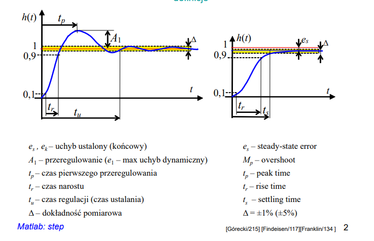
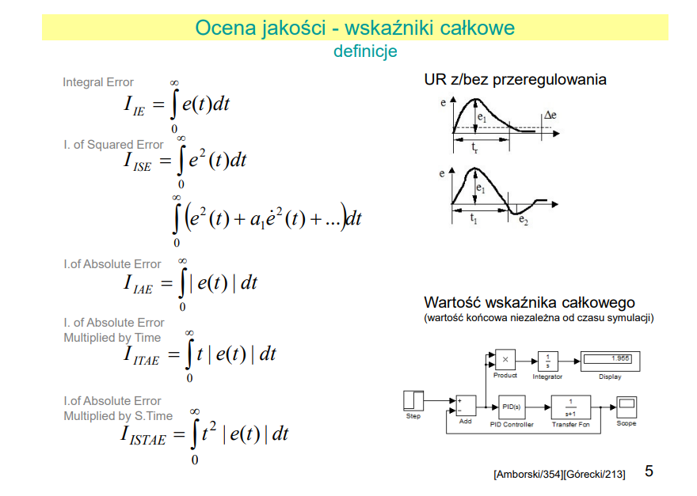

# 1. Układ regulacji
**Układ regulacji** to zbiór elementów mających na celu ustanowić wyjście układu na pożądanej przez nas wartości.

**Przykład:**
*Chcemy by w pomieszczeniu było 29°C, ustawiamy na termostacie a układ regulacji (jakiś) tak grzeje by tą temperaturę w pomieszczeniu utrzymać automatycznie*

# 2 Podstawowe algorytmy
- regulator dwustawny
- regulator trójstawny
- regulator PID
  - anty-windup
  - ograniczenia górne i dolne
- regulacja pogodowa

### Regulator dwustawny

*poniżej przykłąd regulacji dwustawnej - PV to np. temperatura, czerwony sygnał to załączenie pieca, SP to temperatura jaką chcemy osiągnąć, a zielony to wyłącznik całego sterowania który jest tutaj ekstra, ale nie znalazłem lepszego wykresu*

**Histereza** na powyższym obrazku zaznaczona Hys jest to przedział wartości sterowanej w którym temperatura jest akceptowalna przez nasz układ regulacji

*można jeszcze się spotkać z takim rysunkiem który przedstawia charakterystykę regulatora dwustanego z histerezą*

### Regulator trójstawny

Można by powiedzieć że to samo co dwustawny tylko poniżej pewnego zakresu grzejemy, a powyżej pewnego chłodzimy wtedy histerezy są wtedy dwie

### Regulator PID

Regulator **PID** jest najpopularniejszym regulatorem składającym się z członów:

- P - proporcjonalnego - reaguje na bieżący błąd
- I - całkującego - eliminuje skumulowane błędy z przeszłości
- D - różniczkującego - przewiduje przyszłe błędy

*Tutaj jeżeli ktoś nmie pamięta/nie czuje odsyłam do [wszechboga elektroniki](https://www.youtube.com/watch?v=ecOGDeYjt0M) itp.: *

**Anty-widup** jest dodatkowym elementem zapobiegającym nadmiernemu *nacałkowaniu* się wartości regulatora PID w momencie wyjścia poza zakres elementu wykonawczego

**Przykład:**
*Chcemy mieć 29°C w pomieszczeniu ale nasz grzejnik nie ma na tyle mocy, człon I w regulatorze o tym nie wie i uznaje to za błędnie wysterowaną wartości więc błąd się snowballuje (windup)*

### Regulacja pogodowa

Regulacja wykorzystująca krzywe pogodowe, służy do osiągania wskazanej wartości (np. tempe-
ratury medium w obwodzie) w zależności od aktualnej temperatury na zewnątrz. Krzywe pogodowe
są zależnością wyznaczaną przez ówcześnie przeprowadzone badania.

**Na chłopski rozum**, patrzymy jak temperatura w pomieszczeniu odpowiada na zmiany temperatury na zewnątrz. Na podstawie tych zmian określamy krzywe pogodowe czyli zależność jednego
od drugiego. Następnie wykorzystujemy tę informacje do wysterowania np. temperatury medium grzewczego czy mocy pieca.

**ograniczenia górne i dolne** proste ograniczenia wartości wyjściowej regulatora w celu zabezpieczenia elementu wykonawczego przed zniszczeniem

# 3 Projektowanie *PID*

1. Stan ustalony - czekamy na stan ustalony w odpowiednim punkcie pracy (nie będziemy badać tam gdzie nie będziemy używać)
2. Skok jednostkowy i odpowiedź - zadajemy skok wskazanie o wartości około 10\% możliwości
3. Identyfikacja - Dobór modelu i badanie odpowiedzi skokowej
4. Dobór nastaw - wybranie metody doboru nastaw
5. Symulacja - (jeżeli możliwa) by wykluczyć usterki i wprowadzić potencjalne faktory bezpieczeństwa
6. Strojenie/Optymalizacja - teoria i praktyka sprawdza się tylko w teorii więc na żywo na obiekcie wprowadzamy regulacje lub rozszerzamy badania i powtarzamy proces

### Identyfikacja *PID*

Tutaj ważne jest dobranie odpowiedniego modelu do odpowiedniego obiektu

**Podstawowe znane nam**
- **Model Küpfmüllera**

### Dobór nastaw *PID*

Dla danego modelu wskazane są odpowiednie sposoby doboru nastaw

**Podstawowe znane nam**
- **1 metoda Zieglera-Nicholsa** - doprowadzanie obiektu to niegasnący oscylacji przez człon P analiza drgań i obliczanie reszty członów
- **2 metoda Zieglera-Nicholsa** - odczyt odpowiedzi skokowej i obliczanie nastaw według wzoru
- **różne algorytmy auto-tune**

# 4 Wskaźniki jakości

Nie ma co tłumaczyć, jest kilka wskaźników które w odpowiednich sytuacjach i typach badań/o-
biektów mogą nam się mniej lub bardziej przydać.

*Wykresy zapożyczone z prezentacji dr inż. Anny Czemplik*

